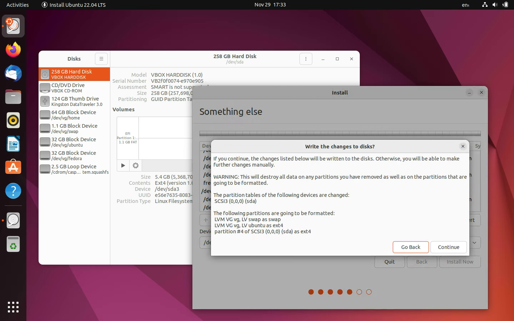

For comments, check: https://github.com/budhajeewa/writings/issues/1.

---

# Creating a Fedora and Ubuntu Encrypted Dual Boot that Uses the Same User Account with 99% GUI Only Operation

I am currently dual-booting Ubuntu 22.04 (For work and personally.) and Windows 11 (For occasional gaming.) on my main laptop. I used the excellent tutorial by Mike Kasberg (https://www.mikekasberg.com/blog/2020/04/08/dual-boot-ubuntu-and-windows-with-encryption.html) to make the Ubuntu portion of the disk encrypted, and it is working butter smooth for a long time.

I still have my old laptop with me and thought that I should try Fedora on it, as I have been meaning to give it a test run for a very long time.

One pain point in the Mike’s post linked above is that it has a lot of CLI chores to do when it comes to creating the encrypted LVM Volume Group. While I am perfectly comfortable doing all of those in a CLI, I also know that a GUI makes it all the more easier and accessible to a larger set of people.

A good thing about Fedora is that it comes with a cool storage management tool called “Blivet GUI”, that can manage partitions like GParted, and also can manage LVM Volume Groups and Logical Volumes (Those things are used to make the OS installations encrypted.). That makes the whole process very easy, and we don’t have to do any CLI set-up in Fedora install, and only have to do a minimal CLI task at the end of the Ubuntu install.

Although very small, you must do that part, as otherwise, you won’t be able to boot into the Ubuntu installation. If you missed it, however, you can simply boot back into a Ubuntu Live USB environment, and do what you forgot to do the first time; you just have to remember where you installed things, like what partition you allocated for root, boot, and home mount points.

So, without further ado, let’s jump right into the process, starting with installing Fedora. I am assuming you have bootable installation media for both Ubuntu and Fedora at this point. I am also assuming that you are using a completely empty storage medium, though even if you are not, you should be able to follow the instructions on the free space you have left.

## Set Up Encrypted Volumes and Install Fedora


Once you have booted into the Fedora live environment, start the installer. After selecting the language to be used during the installation process, you will be asked to select “Installation Destination”. From there, select the disk you want to install the OSes and under “Storage Configuration”, select “Advance Custom (Blivet-GUI)” option and click the “Done” button in the window header.


Next you will be taken to the “Blivet GUI Partitioning” step. I am using a 240 GiB disk for this example, and I will partition it as follows.:

- EFI Partition: 1 GiB
- Encrypted LVM Volume Group: 229 GiB
- Fedora Boot Partition: 5 GB
- Ubuntu Boot Partition: 5 GB

The encrypted LVM Volume Group will again be divided into following LVM Logical Volumes:

- Fedora Root: 30 GiB
- Ubuntu Root: 30 GiB
- Common Home: 60 GiB
- Common Swap: 1 GiB
- Free Space: 108 GiB

Don’t worry about leaving unused free space. LVM makes it super easy to create Logical Volumes dynamically and assign them to mount points anytime after installation, though if you want, you are free to create them right now. I prefer to keep the installation process simple and not do that right now.

To create the EFI partition, select the available free space, and click the “Plus Button”. And then in the pop-up window, make the following modifications and selections:

- Device type: Partition.
- Size: 1 GiB
- Filesystem: EFI System Partition
- Label: EFI
- Mountpoint: /boot/efi


And click “OK”.

To create the Encrypted LVM Volume Group, select the available free space, and click the “Plus Button” again. This time, in the pop-up windows, make following choices:

- Device type: LVM2 Volume Group
- Size: 229 GiB
- Name: vg
- Encrypt: Check. This is most important. This is what is going to make your both OS installations encrypted and safe.
- Sector size: Automatic
- Passphrase: Enter a secure passphrase that you can remember. If you don’t remember this, you won’t be able to access your installed systems or any data stored in it. You will lose your data forever, if you forget this passphrase. But that’s the whole point of encryption..
- Repeat Passphrase: Confirm the passphrase you typed above.


And click “OK”.

Let’s create the Fedora Boot Partition next. Select the free space, click the “Plus Button”, and enter following particulars:

- Device type: Partition
- Size: 5 GiB
- Filesystem: ext4
- Label: Boot_Fedora
- Mountpoint: /boot


And click “OK”.

We will create the Ubuntu Boot Partition later when we’re installing Ubuntu.

After that is done, the partition layout should look similar to the following screenshot.


Now we can turn to creating LVM Logical Volumes.

From the left side bar of the “Blivet GUI Partitioning” step, select the Volume Group “vg” under the “LVM” section, and the right side will update as follows,


To create the Fedora Root Logical Volume, select the free space, and click the “Plus Button”, and enter following particulars:

- Device type: LVM2 Logical Volume
- Size: 30 GiB
- Filesystem: ext4
- Label: Fedora
- Name: fedora
- Mountpoint: /

Pay attention to the spelling difference between “Fedora” and “fedora” in the Label and Name fields above respectively.


Create Ubuntu Root Logical Volume similarly. But we are not specifying a Mountpoint for it. Leave that field blank.

- Device type: LVM2 Logical Volume
- Size: 30 GiB
- Filesystem: ext4
- Label: Ubuntu
- Name: ubuntu


Almost similar for Swap Logical Volume.
- Device type: LVM2 Logical Volume
- Size: 1 GiB
- Filesystem: swap
- Label: Swap
- Name: swap


For Home Logical Volume, we allocate 60 GiB.

- Device type: LVM2 Logical Volume
- Size: 60 GiB
- Filesystem: ext4
- Label: Home
- Name: home
- Mountpoint: /home


Once that is done, our Logical Volumes should look like this:


Now double check that our partitions and Logical Volumes are created as mentioned here and assigned to the correct mount points, and click “Done” button in the screen header. Then you will be presented with a “Summary of Changes” and you can verify it and click “Accept Changes”.


Doing that will bring you to the “Installation Summary” step, and you can nw click the “Begin Installation” button at the bottom right-hand side.


And with that, Fedora installer will start installing the OS onto our disk.


Once the installer is done with its tasks, it will allow you to click the “Finish Installation” button to exit from the installer.


After that, you should restart the machine and boot from the copy of Fedora installed on your disk (Not the installation medium.). Turning off the machine and removing the installation medium before starting it again can help you with that.

If our configuration of encryption is successful, Fedora should ask you to provide a password before it even completes booting up. This is not your user account’s password it is asking for (In fact, as we’re in the first start-up right now, we haven’t even created a user account yet!); you should type in the encryption passphrase you specified when you created the “LVM2 Volume Group” at the start of our installation process.


After you successfully provided the encryption passphrase to decrypt the file system, Fedora will start-up, and present you with the first-launch setup wizard.


We will use the same username in both Fedora and Ubuntu to enable home directory sharing. So pay special attention to the username you specify in the following step, as you would have to enter exactly the same when you install Ubuntu later. However, you do not have to use the same password in both OSes, you can use same or different passwords for the same user under the two OSes.


Once that is done, you’ll log in to the Fedora desktop.

## Install Ubuntu

Now its time to install Ubuntu, so plug in the Ubuntu installation medium, resart the computer, and boot from Ubuntu installation medium.

When given the option, click “Try Ubuntu” button. We have to decrypt the encrypted LVM Volume Group we created from the Fedora Live Environment before we can install Ubuntu on some of the Logical Volumes within that Volume Group.


Once inside the Ubuntu Live Desktop, open the “Disks” tool, and click on the large LUKS encrypted partition, and click the unlock button that looks like an opened padlock.


And then you will have to enter the passphrase you used to encrypt the LVM Volume Group to unlock it.


Once the LVM Volume Group is unlocked, you can begin the Ubuntu installation process. 

In the “Installation Type” screen, you must select the “Something else” option. Then we will be able to manually select the partitions and Logical Volumes we want to use for each of our mountpoints.


For the Ubuntu Boot partition, select the free space after the Fedora Boot partition, and create a new partition with the size of 5 GiB (Ubuntu installer will show sizes in MB.). The labels we assigned to partitions and Logical Volumes will help you identify what’s what. Enter the following particulars for Ubuntu Boot partition:

- Size: Around 5000 MB
- Type of the new partition: Primary
- Location of the new partition: Beginning of this space
- Use as: Ext4 journaling file system
- Mount point: /boot


And click “OK”.

For home mount point, select the “/dev/mapper/vg-home” option with the “ext4” type and click the “Change…” button.


In the “Edit Partition” pop-up, make following choices:

Use as: Ext4 journaling file system
Format the partition: Uncheck. Very important, as Ubuntu is sharing this home Logical Volume with Fedora, we do not want to format it!
Mount point: /home


And click “OK”.

For the Ubuntu Root mount point, select the “/dev/mapper/vg-ubuntu” option with the “ext4” type and click the “Change…” button.


In the “Edit Partition” pop-up, make following choices:

- Use as: Ext4 journaling file system
- Format the partition: Check. This time we want Ubuntu to format this Logical Volume as it sees fit. Ubuntu installer won’t proceed without checking this.
- Mount point: /


And click “OK”.

Now that we have selected partitions and Logical Volumes for Ubunbtu’s Root, Boot, and Home, we can click the “Install Now” button.


It will ask you to confirm the changes, and you should click “Continue”.



**IMPORTANT!** When its time to set a username, set exactly the same username as you set with Fedora. This will lead to both OSes sharing the same user home directory. This is very important to share the same user and in some cases, same applications between the two OSes.


**IMPORTANT!** And when the Ubuntu installer is done doing its job, we must click “Continue Testing”, as there’s a little bit more work we have to do manually. This is the 1% CLI task I mentioned earlier, but fear not, it’s very easy.


First, open the Disks tool, identify the Ubuntu Boot partition, and let’s set a label for that. To do that, select the Ubuntu Boot partition, and click the “Cog Wheel Button”  and select “Edit Filesystem…” option.


In the next pop-up window, enter “Boot_Ubuntu” as the label and click the “Change” button. Also take note of the device name here, which is `/dev/sda4` as we will need it below.


Then open a terminal window and issue the command “ls /dev/mapper”. It will produce an output like this:


We’ll need that output later. Take note of the long name starting with “luks”. Copy it to a text file for easy access.

Now enter the following commands that I am copying right out of Mike’s blog.

```
sudo -i
```

We switch to root user.

```
mount /dev/mapper/vg-ubuntu /target
```

We mount Ubuntu Root Logical Volume to /target.

```
mount /dev/sda4 /target/boot
```

We mount Ubuntu Boot Partition to /target/boot. We took note of `/dev/sda4` device name earlier.

```
for n in proc sys dev etc/resolv.conf; do mount –rbind /$n /target/$n; done
```

We mount files and directories named “proc”, “sys”, “dev”, and “etc/resolv.conf” inside the Ubuntu Live environment’s root directory to matching mountpoints inside /target.

```
chroot /target
```

We change the apparent root to /target.

```
mount -a
```

We mount all filesystems mentioned in fstab.


Now, inside the chroot environment, we create a file named `crypttab` in `/etc` directory. Into it, copy the long name we noted when we issued the `ls /dev/mapper` command earlier. After that, enter a space and “UUID=” followed by the same long name, but without the “luks-” prefix. At the end, we add the text “ none luks,discard”. The final text would look like this:

```
luks-<long-text> UUID=<long-text> none luks,discard
```

The “\<long-text\>” here is actually the UUID of the Partition we used for the LVM Volume Group. We can verify that the correct content was added to the `/etc/crypttab` file by running `cat` command on it.


Now we have to issue the following final command:

```
update-initramfs -k all -c
```


Now you can restart your machine. 

You can now use your machine UEFI Boot Menu or each OS’s Grub menu to switch between the OSes.

If one OS’s Grub menu doesn't show the other OS, just log into the OS that has the problem, mount the other OS’s root Logical Volume, and update Grub. This process can vary between Fedora and Ubuntu, and I don’t hope to get into that in this guide.

After restarting, go to Fedora, and let’s do a trick to make sure the two OSes are sharing the same user. Open the user’s home folder, and the “Desktop” folder in it. Create a text file in it, and add any recognizable text you’d like.


Now restart and boot into Ubuntu, and check your desktop to see a message from Fedora! You can even type a reply.


If you’d like, log back into Fedora to see the reply too!


---

For comments, check: https://github.com/budhajeewa/writings/issues/1
